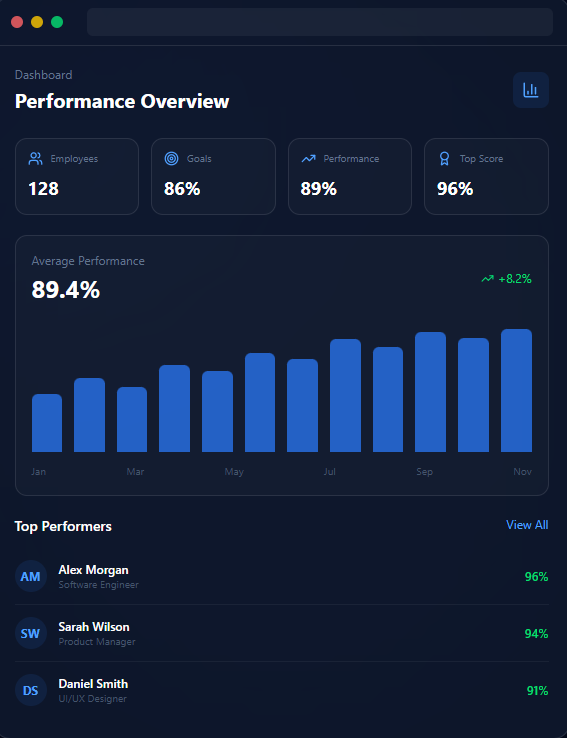

# 🚀 PerformanceTrack - Employee Performance & Task Management System

A full-stack web application designed to streamline workforce management, task delegation, attendance tracking, and automated performance analytics for modern teams.



---

## 📌 Features

### 👨‍💼 Admin Portal
- **Analytics Dashboard**: Overview of total staff, active/inactive counts, department distribution, average performance score, and monthly trends.
- **Employee Management**: Add, update, view, and delete employee records with auto-generated Employee IDs (`EMP001`, `EMP002`, etc.) and temporary password generation.
- **Task Assignment & Review**:
  - Assign tasks with priority, due date, performance weight, and starter GitHub repository link.
  - Review submitted GitHub repositories and notes from employees, provide feedback, and approve/mark as completed.
- **Attendance Management**: Daily attendance logs with filters by department, status, and employee search. Admin can override or mark status with notes.
- **Performance Evaluation**: Real-time performance metrics and leaderboard ranking employees across four KPI benchmarks.
- **Broadcast Announcements**: Send direct notifications or broadcast alerts to all employees.

### 👩‍💻 Employee Portal
- **Employee Dashboard**: Summary of assigned tasks, completion progress, today's attendance badge, and recent activity.
- **My Tasks & GitHub Submission**:
  - View tasks categorized by status (*Pending*, *In Progress*, *Under Review*, *Completed*).
  - Submit finished work by attaching a GitHub repository URL and completion notes.
- **Attendance & Time Clock**:
  - One-click daily Check-In and Check-Out.
  - Automatic punctuality detection (marks *Late* if checked in after 9:30 AM).
  - Automatic working hours computation.
- **Performance Analytics**: Visual KPI breakdown, grade badges (*A+*, *A*, *B+*, etc.), 6-month performance score trend chart, and personalized actionable improvement tips.
- **Notifications Hub**: In-app notifications with unread badges for task assignments, feedback, and announcements.

### ⚡ Automated KPI & Performance Calculation
Performance score (scale of 1 to 10) is dynamically recalculated using a multi-factor formula:
$$\text{Score} = (40\% \times \text{Task Completion}) + (30\% \times \text{On-Time Delivery}) + (20\% \times \text{Attendance Regularity}) + (10\% \times \text{Punctuality})$$

---

## 🛠️ Tech Stack

### Frontend
- **Framework**: React 19 + Vite
- **Styling**: Tailwind CSS v4
- **Routing**: React Router DOM v7
- **Icons**: Lucide React
- **Charts & Graphs**: Recharts

### Backend
- **Runtime**: Node.js
- **Framework**: Express.js
- **Database**: MongoDB (via Mongoose ODM)
- **Authentication**: JWT (JSON Web Tokens) + Bcrypt.js password hashing
- **Environment**: Dotenv + CORS

---

## 📁 Project Structure

```text
employee/
├── backend/
│   ├── middleware/
│   │   ├── adminMiddleware.js       # Admin JWT authorization middleware
│   │   └── authMiddleware.js        # User/Employee authentication middleware
│   ├── models/
│   │   ├── attendance.js            # Attendance schema & date indexing
│   │   ├── notification.js          # Notification schema
│   │   ├── task.js                  # Task model with GitHub repository fields
│   │   └── user.js                  # User/Employee model
│   ├── routes/
│   │   ├── adminDashboardRoutes.js  # Admin analytics & overview endpoints
│   │   ├── adminEmployeeRoutes.js   # Employee CRUD & password reset endpoints
│   │   ├── attendanceRoutes.js      # Attendance check-in/out & admin logs
│   │   ├── authRoutes.js            # Login & Admin registration
│   │   ├── employeeDashboardRoutes.js # Employee dashboard & performance stats
│   │   ├── notificationRoutes.js    # Notifications & announcements
│   │   └── taskRoutes.js            # Task creation, submission & reviews
│   ├── utils/
│   │   └── performanceCalculator.js # Automated performance scoring algorithm
│   ├── .env                         # Backend environment variables
│   ├── package.json
│   └── server.js                    # Express app entry point & MongoDB connection
│
├── public/
│   ├── dashboard-preview.png        # Preview image for landing page
│   └── favicon.svg                  # Favicon
│
├── src/
│   ├── assets/
│   │   └── Logo.png                 # Application logo
│   ├── components/
│   │   ├── admin/
│   │   │   └── AdminSidebar.jsx     # Admin navigation sidebar
│   │   ├── Employee/
│   │   │   └── EmployeeSidebar.jsx  # Employee navigation sidebar
│   │   └── navbar.jsx               # Main header & navigation bar
│   ├── pages/
│   │   ├── Admin/
│   │   │   ├── AddEmployee.jsx      # Add new employee form
│   │   │   ├── AdminDashboard.jsx   # Admin statistics overview
│   │   │   ├── AssignTasks.jsx      # Task delegation & repo review
│   │   │   ├── Attendance.jsx       # Daily attendance records
│   │   │   ├── emp_management.jsx   # Employee list, edit & delete
│   │   │   └── Performance.jsx      # Employee performance leaderboard
│   │   ├── Employee/
│   │   │   ├── Attendance.jsx       # Employee check-in/out & history
│   │   │   ├── EmployeeDashboard.jsx # Employee overview & metrics
│   │   │   ├── MyTasks.jsx          # Task board & GitHub submit modal
│   │   │   ├── Notifications.jsx    # Notifications view
│   │   │   └── Performance.jsx      # KPI breakdown & charts
│   │   ├── AdminRegister.jsx        # Admin signup page
│   │   ├── Home.jsx                 # Landing page
│   │   └── login.jsx                # Universal login (Admin/Employee)
│   ├── utils/
│   │   └── auth.js                  # Multi-role authentication & session helpers
│   ├── App.jsx                      # Route definitions
│   ├── index.css                    # Tailwind CSS configuration
│   └── main.jsx                     # React root mount
│
├── .gitignore
├── index.html
├── package.json
└── vite.config.js
```

---

## ⚙️ Installation & Setup

### Prerequisites
- [Node.js](https://nodejs.org/) (v18 or higher recommended)
- [MongoDB](https://www.mongodb.com/) (Local instance or MongoDB Atlas URI)

---

### 1️⃣ Backend Setup

1. Open a terminal and navigate to the `backend` directory:
   ```bash
   cd backend
   ```

2. Install dependencies:
   ```bash
   npm install
   ```

3. Configure environment variables by checking or creating `backend/.env`:
   ```env
   PORT=5000
   MONGO_URI=mongodb://localhost:27017/employee_db
   JWT_SECRET=your_jwt_secret_key_here
   ```

4. Start the backend server:
   ```bash
   # Production / standard start
   npm start

   # Development with auto-reload
   npm run dev
   ```
   Backend will run on `http://localhost:5000`.

---

### 2️⃣ Frontend Setup

1. Open a new terminal in the root directory:
   ```bash
   npm install
   ```

2. Start the Vite development server:
   ```bash
   npm run dev
   ```

3. Open your browser and navigate to:
   ```
   http://localhost:5173
   ```

---

## 🔑 Default Flow & Getting Started

1. **Register Admin**:
   - Go to `http://localhost:5173/AdminRegister`
   - Complete the form to create the initial Administrator account.
2. **Login**:
   - Go to `http://localhost:5173/login`
   - Sign in using your Admin credentials.
3. **Add Employees**:
   - Navigate to **Employees > Add Employee** to register team members.
   - Note the generated **Employee ID** and **Temporary Password**.
4. **Assign Tasks**:
   - Go to **Tasks > Assign Task** to assign deliverables with GitHub repo requirements.
5. **Employee Access**:
   - Sign in as an Employee using the generated Employee ID and temporary password.
   - Clock in attendance, complete tasks, attach repository URLs, and track performance scores.

---

## 📡 API Reference Overview

| Method | Endpoint | Access | Description |
|---|---|---|---|
| `POST` | `/api/auth/register-admin` | Public | Register new Administrator |
| `POST` | `/api/auth/login` | Public | Login for Admin & Employees |
| `GET` | `/api/admin/dashboard` | Admin | Get system statistics & overview |
| `GET` | `/api/admin/employees` | Admin | List all employees |
| `POST` | `/api/admin/employees` | Admin | Create employee & generate password |
| `PUT` | `/api/admin/employees/:id` | Admin | Update employee details |
| `DELETE` | `/api/admin/employees/:id` | Admin | Delete employee record |
| `GET` | `/api/admin/tasks` | Admin | List all assigned tasks |
| `POST` | `/api/admin/tasks` | Admin | Create and assign a task |
| `PATCH` | `/api/admin/tasks/:id/status` | Admin | Review & approve completed tasks |
| `GET` | `/api/attendance/admin/all` | Admin | Get daily attendance records |
| `GET` | `/api/employee/dashboard` | Employee | Get employee profile & dashboard summary |
| `GET` | `/api/employee/performance` | Employee | Get KPI breakdown & trend data |
| `GET` | `/api/tasks/my-tasks` | Employee | Get tasks assigned to logged-in employee |
| `POST` | `/api/tasks/:id/submit` | Employee | Submit task with GitHub repo URL & notes |
| `POST` | `/api/attendance/check-in` | Employee | Daily morning attendance check-in |
| `POST` | `/api/attendance/check-out` | Employee | Daily attendance check-out |
| `GET` | `/api/notifications/my-notifications` | Employee | Get in-app notifications |

---

## 📄 License

This project is licensed under the [ISC License](LICENSE).
